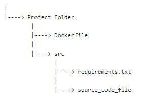

# T-Reqs

T-Reqs is a multi-language requirements file generator which also serves the purpose of preparing a template Dockerfile.  After a suggested preview, the developer should be ready to generate images for further work. Currently, the supported languages for the source file are Python and GO. It basically searches the entire app code file for the packages required, based upon the 'import' keyword. It writes the required dependencies on a requirements.txt file. Furthermore, the listed dependencies/packages are borrowed from the requirements file and are written on a template Dockerfile for further usage.  

 
 

This tool can prove to be really time-saving when you are working on a Docker application. You just need to have the app source coude file and the basic project directory will be created containing the required files. It is suggested that a preview is made before finalizing anything. Since, this is a beta version, some entries inside the Dockerfile may be incomplete for much more complicated projects and may require a little bit of manual adjustments. Work is being done to make the whole process a lot more efficient. 

 
 

<b> The Directory Structure  </b>
 

 As shown in the image, a new project folder will be created which will contain the mentioned files 

The user will be asked to enter a main project directory name. This will contain the Dockerfile and the src folder. The src folder will keep a copy of the original source code file and the automatically generated requirements file. 

Also, it's to be noted that it acts a miniature <i> version control </i> system on it's own. If any changes are made to the original source code, then executing the tool will refresh everything in the project directory, deleting all the older versions. 

 

<b>How to use ?</b> 

 
        Basically, the only prerequisite required for execution is the Java Runtime Environment (JRE).  
 

   
        
For using the JAR, just follow these simple instructions. After the application is launched, it will ask for some basic user entry. Fill those out. And VOILA !!! It's done. It's that easy. You Dockerfile is almost ready to go but it is recommended to make some changes, if needed before using it.   

         
        
        
        
               
          

          
         

