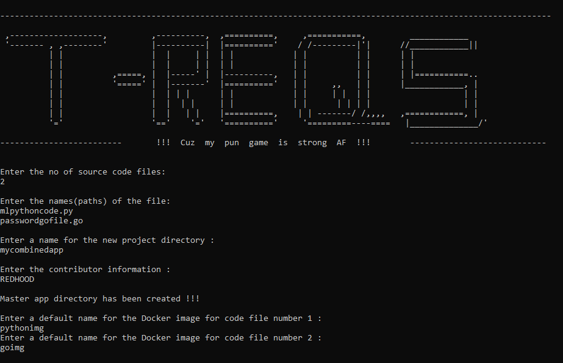

# T-Reqs

T-Reqs is a multi-language requirements file generator which also serves the purpose of preparing a template Dockerfile and also, a template docker-compose file.  After a suggested preview, the developer should be ready to generate images for further work. Currently, the supported languages for the source file are Python and GO. It basically searches the entire app code file for the packages required, based upon the 'import' keyword. It writes the required dependencies on a requirements.txt file. Furthermore, the listed dependencies/packages are borrowed from the requirements file and are written on a template Dockerfile for further usage.  

 
  

This tool can prove to be really time-saving when you are working on a Docker application. You just need to have the app source coude file and the basic project directory will be created containing the required files. It is suggested that a preview is made before finalizing anything. Since, this is a beta version, some entries inside the Dockerfile may be incomplete for much more complicated projects and may require a little bit of manual adjustments. Work is being done to make the whole process a lot more efficient. 

 

<b>  </b>
 

## The Directory Structure

 As shown in the image, a new project folder will be created which will contain the mentioned files 

The user will be asked to enter a main project directory name. This will contain the Dockerfile and the src folder. The src folder will keep a copy of the original source code file and the automatically generated requirements file. 

Also, it's to be noted that it acts a miniature <i> version control </i> system on it's own. If any changes are made to the original source code, then executing the tool will refresh everything in the project directory, deleting all the older versions. 

 

<b></b> 

##  How to use ?

  Basically, the only prerequisite required for execution is the Java Runtime Environment (JRE).  
 

  
**Step-1 :**    Move  to  the  JAR  file  to  a  preferred  location.  

**Step-2 :**    Initialize  the  DOSKEY  batch  file  with  path  of  the  JAR  file  and  save  it  with  .bat  extension.  

**Step-3 :**    Add  the  path  of  the  batch  file  to  the  target  of  the  CMD.  

**Step-4 :**    Start  the  CMD.  

**Step-5 :**    Navigate  to  the  directory  of  the  source  code  file.  

**Step-6 :**    Type  ‘treqs’  and  follow  the  instructions.  

   
        
For using the JAR, just follow these simple instructions. After the application is launched, it will ask for some basic user entry. Fill those out. And VOILA !!! It's done. It's that easy. You Dockerfile is almost ready to go but it is recommended to make some changes, if needed before using it.   

         
         
	
## Languages supported 
- Python 
- Go
 

        
	
 ## Instructions in a nut-shell   
 

 
 
 

## What's new ?  
 Now, you can use projects involving multiple source code files of varying formats. The tool will successfully create a requirements.txt, a Dockerfile, a docker-compose.yaml file for each of the code files in separate app folders for smooth management. You just need to mention the files you want to work with properly, that's it !!!! 
	  
 

 
 
        
  
<b> NOTE: </b> This is just a beta version, which means, yes, it has some bugs that I'm still trying to figure out. At the moment, the application works for Python and Go projects but it'll be extended to other languages as well in the near future. Feel free to share your thoughts regarding any possible improvements so as to increase the overall scope of this project. All suggestions are more than welcome. Again, I would like to mention that the files generated should be previewed properly for any required changes. Sometimes, the version of the dependencies may not be updated, so, the user may need to make the changes. Any pending issues will be fixed.  

        
        
        

          
         

